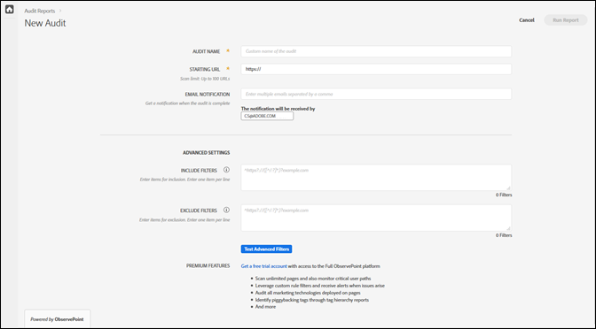
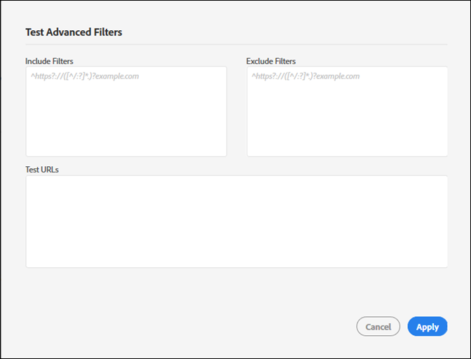

# Skapa en ny granskning{#create-a-new-audit}

>[!NOTE]
>
>Användare är begränsade till en granskning som körs åt gången. Ett fel uppstår om du försöker starta en granskning med samma inställningar som den som körs. Du kan använda länken i felmeddelandet om du vill avbryta den granskning som körs så att du kan skapa en ny.

Om du vill kan du använda länken längst ned på sidan för att få tillgång till ett kostnadsfritt, fullständigt funktionellt utvärderingskonto med ObservePoint.

1. Klicka på i listan Granskare **[!UICONTROL New Audit]**.

   Skärmen [!DNL New Audit] öppnas.

   

1. (Obligatoriskt) Namnge granskningen.

   Namnet kan innehålla upp till 250 tecken.
1. (Obligatoriskt) Ange den inledande URL:en.

   Protokollet krävs när du anger den första URL:en. Den första URL:en är den sida där granskningen börjar crawla. När Adobe Experience Platform Auditor väl har startat crawlas upp till 500 sidor efter länkar som börjar på startwebbadressen. Mer information finns i [Inkludera och exkludera filter](../create-audit/filters.md) . Start-URL:en kan innehålla upp till 250 tecken.

   >[!NOTE]
   >
   >I vissa fall kan det ta upp till 48 timmar att slutföra en 500-sidig skanning.

1. Ange en eller flera e-postadresser för meddelanden om den här granskningen.

   Du kan ange flera e-postmeddelanden genom att separera varje adress med ett kommatecken. Begäraren meddelas som standard. E-postadresser valideras i realtid. Om du anger en ogiltig adress visas ett meddelande på skärmen.

   Varje e-postmeddelande får innehålla högst 250 tecken, inklusive domänslutet (till exempel .com).

1. Ange [!UICONTROL Include Filters].

   Det här fältet kan innehålla exakta URL:er, partiella URL:er eller reguljära uttryck. Använd det här fältet för kriterier som du vill att alla URL:er ska matcha. Alla crawlade URL:er som inte uppfyller villkoren [!UICONTROL Include Filter] inkluderas inte i granskningsresultaten.

   Du kan ange kataloger som du vill att granskningen ska söka igenom. Eller så kan du utföra granskning över domäner eller självrefererande, där du måste starta granskningen på en domän och avsluta på en annan. Skriv in de domäner du vill gå igenom; för komplexa URL-mönster, använd ett reguljärt uttryck.

   >[!NOTE]
   >
   >Om du inkluderar en sida i filtren, men den inte är ansluten till din första URL, eller om Platform Auditor skannar 500 sidor innan den når den sidan, skannas inte sidan och inkluderas inte i testresultaten.

   Inkluderingsfiltren får innehålla högst 1 000 tecken per rad.

   Mer information finns i [Inkludera lista](../create-audit/filters.md) .
1. Ange Exkludera filter.

   Detta [!UICONTROL Exclude List] förhindrar att URL:er granskas. Använd exakta URL:er, partiella URL:er eller reguljära uttryck, precis som i [!UICONTROL Include List]dialogrutan.

   En vanlig metod är att utesluta en utloggningslänk om granskningen har en användarsession (till exempel: `/logout`, vilket innebär en URL som innehåller strängen `/logout`).

   Exkluderingsfiltren är begränsade till 1 000 tecken per rad.

   Mer information finns i [Uteslut lista](../create-audit/filters.md) .
1. (Valfritt) Om du vill kan du testa filtren include och exclude och testa dina URL:er.

   Ange filter och URL:er och klicka sedan på **[!UICONTROL Apply]** för att köra testet.

   

1. Klicka på **[!UICONTROL Run Report]**.
