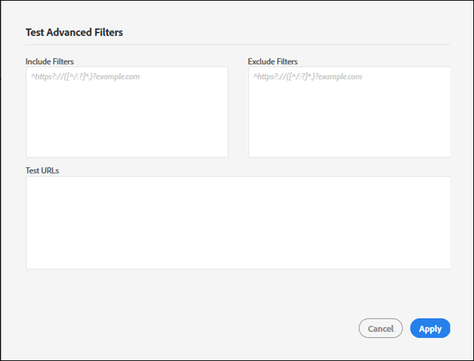

# Inkludera och exkludera filter{#include-and-exclude-filters}

Inkludera filter begränsar vilka länkar en granskning kan crawla från Start-URL:en. Undanta filter förhindrar att en granskning crawlar länkar.

<!--
Content from ObservePoint (https://help.observepoint.com/articles/2872121-include-and-exclude-filters) with their permission. Modified slightly for style and Auditor emphasis.
-->

Inkludera filter och Uteslut filter ger riktlinjer för revisioner. Genom att låta filtren Inkludera och Uteslut vara tomma kan en granskning crawla alla länkar som den stöter på, med början med länkar på den inledande URL:en.


Genom att använda Inkludera filter, Uteslut filter eller en kombination av båda, får du instruktioner om vilka länkar en granskning kan crawla.

Alla objekt i [!UICONTROL Include Filters] inläsningen begränsas av fältet till endast de sidor som matchar det objektet. Alla objekt i en [!UICONTROL Exclude Filters] -fältet förhindrar att sidor som matchar det objektet skannas.

Filtren Inkludera och Uteslut kan vara fullständiga URL:er, partiella URL:er eller reguljära uttryck som matchar en giltig sida.

## Prioritetsordning {#section-e9d42419dd3f459bb20e7a33c6104f12}

1. **Startar URL** har företräde framför allt annat och kommer alltid att besökas under en granskning, även om en URL matchar ett objekt i Uteslut-filtret. Start-URL:en besöks alltid före andra URL:er.

   

   I bilden ovan upptäcker en granskning länkar från startsidans `document.links` -egenskap. Länkarna kan skannas av granskningen.

1. **Inkludera URL:er** måste länkas från en startsida, annars kan de inte identifieras och kommer inte att besökas.

   

   Om du lägger till ett Include-filter i bilden ovan begränsas de URL:er som är giltiga till de som matchar filtret. Nu kan bara fem länkar skannas av granskningen.

1. **Uteslut URL:er** ta bort länkar från berättigandet.

   

   Om du lägger till ett Uteslut-filter i bilden ovan förhindras URL:er från de giltiga länkarna. Nu kan endast tre länkar skannas av granskningen.

## Startar URL {#section-ccb46abcd96f4a8ab171245015d2b724}

Adobe Experience Platform Auditor kräver en enda sida för Start-URL:en. Start-URL:en besöks alltid före andra URL:er. Alla länkar som hittas från startsidan kan besökas, med förbehåll för filtren Inkludera och Uteslut. Om ett Exkludera-objekt matchar en Start-URL ignoreras det.

## Inkludera filter {#section-7626060a56a24b658f8c05f031ac3f5f}

Inkluderingsfiltren begränsar vilka länkar som kan skannas under en granskning. Inkluderingsfilter kan vara:

* Fullständigt kvalificerade URL:er
* Delvis URL
* Reguljära uttryck som matchar fullständiga eller partiella URL:er
* Valfri kombination av ovanstående

Att lägga till URL:er eller reguljära uttryck i filtret Inkludera garanterar inte att dessa specifika URL:er skannas in i granskningen. Granskningen undersöker länkarna på Start-URL:en och navigerar sedan genom de giltiga länkarna. Granskningen fortsätter med inspektionen och navigeringen tills gränsen på 500 skannade URL:er nås eller tills inga fler giltiga länkar hittas.

>[!NOTE]
>
>I vissa fall kan det ta upp till 48 timmar att slutföra en 500-sidig skanning.

Som standard genomsöks alla underdomäner till den första URL:en. Om du inte uttryckligen åsidosätter genom att ange ett inkluderingsfilter kommer följande regex-inkluderingsfilter att användas:

`^https?://([^/:\?]*\.)?mysite.com`

Detta gör att alla länkar på startwebbsidan kan besökas. Den matchar alla sidor på alla underdomäner från Start-URL:en.

Standardfiltret Inkludera ger ett brett intervall för en granskning som ska crawlas. Om du vill gå till vissa avsnitt eller sidor anger du specifika anvisningar för granskningen genom att lägga till filter i den här rutan. I så fall ska du ersätta standardvärdet med de kataloger som du vill att granskningen ska söka igenom. Du kan också använda Inkludera filter för att utföra domänövergripande granskning där du måste starta granskningen på en domän och avsluta på en annan. Skriv in de domäner du vill gå igenom. För att du ska kunna hitta eventuella inkluderingsfilter-URL:er måste de identifieras på en reviderad sida.

Filtren Include kan innehålla exakta URL:er, partiella URL:er eller reguljära uttryck. Om till exempel den inledande URL:en är [!DNL http://mysite.com], kan följande sidor skannas som standard (observera feta tecken):

```html
http://mysite.com
http
<b>s</b>://mysite.com
http://
<b>www</b>.mysite.com/home
http://
<b>dev</b>.mysite.com/home
http://
<b>my</b>.mysite.com/products/products_and_services.html
```

Använd för komplexa URL-mönster [ObservePoints reguljära uttrycksprovare](https://regex.observepoint.com/).

## Uteslut filter {#section-00aa5e10c878473b91ba0844bebe7ca9}

Filtren Uteslut förhindrar att URL:er granskas. Du kan använda exakta URL:er, partiella URL:er eller reguljära uttryck. URL:er som matchar ett objekt i Uteslut-filtren visas inte. Om din Start-URL finns med i Uteslut-filtren är den inte exkluderad. Start-URL:en genomsöks alltid av en granskning.

## Testfilter och URL:er {#section-3cfa125b1756411395a64701e128efa0}

Du kan testa dina filter och URL:er i plattformsgranskaren.

Klicka på **[!UICONTROL Test Advanced Filters]**. Ange filter och URL:er och klicka sedan på **[!UICONTROL Apply]**.



## ObservePoint-dokumentation {#section-79cdc8e850d047969b6d2badf6bbd6f9}

Den här artikeln har utvecklats i samarbete med ObservePoint. Den senaste informationen finns i [ObservePoint-dokumentation](https://help.observepoint.com/.
