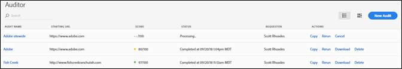
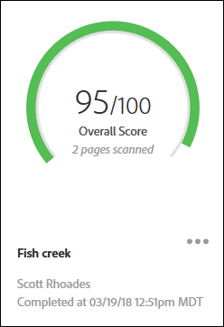
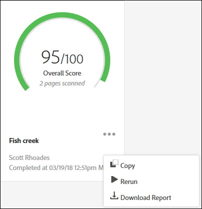

# Sida för granskningslista{#audit-list-page}

På sidan Granskningslista visas information om alla granskningar.

När du startar Granskare visas sidan Granskningslista. Du kan visa sidan Granskningslista som en lista eller som en kortvy.

## Listvy {#section-a428749d2ab94a08bf460e6a486b844a}

I listvyn visas följande information för alla granskningar.

* Granskningsnamn
* Startar URL

   Den URL där granskningen börjar crawla sidorna.
* Poäng

   Granskningar utvärderas från 1 till 100, vilket innebär att det inte finns några problem med de skannade sidorna.
* Status

   Visar när granskningen slutfördes eller att den bearbetas.
* Begärande

   Visar namnet på den användare som skapade granskningen.
* Åtgärder

   Innehåller länkar för att kopiera eller köra om granskningen, avbryta en granskning som körs, hämta en rapport som ett Excel-kalkylblad eller ta bort granskningen.

Klicka på granskningens namn för att visa granskningsresultaten.

## Kortvy {#section-6826b585e53a46daa722b9bd3eda926e}

Kortvyn visar varje granskning i ett grafiskt format.

Klicka på granskningens namn för att visa granskningsresultaten. Klicka på menyn bredvid namnet för att se länkar för kopiering, omkörning eller avbrytande av granskningen, eller för att ladda ned en färdig rapport som ett Excel-kalkylblad eller PDF:

