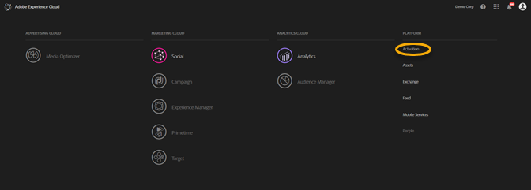
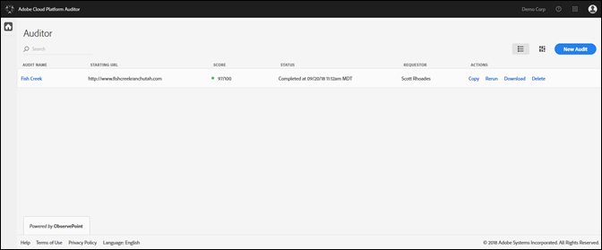
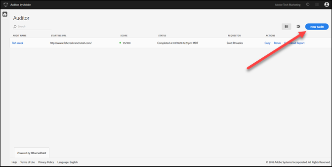
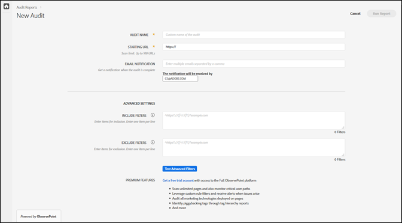
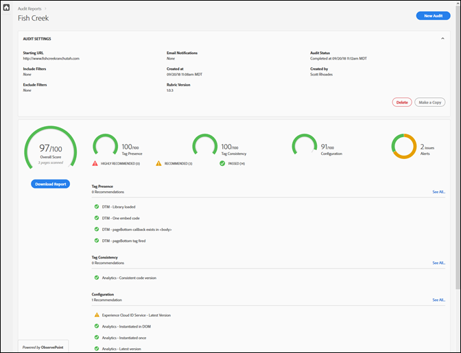

# Komma igång{#getting-started}

## Komma igång {#task-1024e94b5948413295c9698e62165a04}

<!--
This page is a placeholder for now, we need things like prerequisites, any planning that should be done before using Auditor, initial setup info--that kind of thing.
-->

Första gången du använder Auditor måste du fylla i och godkänna Auditor-avtalet. Revisorn har utvecklats som ett samarbete mellan Adobe och ObservePoint. Granskarna får använda begränsad ObservePoint-funktionalitet utan extra kostnad. Om du vill använda Granskare måste du välja att få kommunicera från ObservePoint.

## Kör din första sökning {#task-b211597afed343cfa238443fcf7c6041}

1. Klicka på menyknappen i det övre högra hörnet av navigeringsfältet i Adobe Experience Cloud och klicka på **[!UICONTROL Activation]**.

   

1. Välj Granskare och godkänn användningsvillkoren.

   På sidan Auditor får du en kontrollpanel med tidigare sökningar tillsammans med alternativet att köra en ny skanning.

   

1. Klicka på **[!UICONTROL New Audit]**.

   Om du vill köra en ny skanning klickar du **[!UICONTROL New Audit]** i skärmens övre högra hörn.

   

1. Konfigurera genomsökning.

   Namnge granskningen, ange en start-URL och klicka på **[!UICONTROL Run Report]**. När sökningen är klar får du ett e-postmeddelande.

   

   En beskrivning av alla konfigurationsalternativ finns i [Skapa en ny granskning](../create-audit/create-new-audit.md).
1. Visa din rapport.

   När du får e-postmeddelandet som talar om att sökningen är klar klickar du på länken för att [visa rapporten](../reports/scorecard.md) och börja förstå möjligheterna att förbättra implementeringen och få ut mer av Adobe-lösningarna.

   Du kan också klicka på granskningens namn på [revisionssidan](../get-started/audit-list.md) för att visa granskningens status och för att visa rapporten när granskningen är klar.

   
