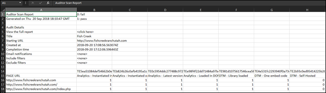

# Hämta rapport{#download-report}

Rapporten visar om varje URL godkänns eller misslyckas.

Rapporten kan visas på styrkortssidan i användargränssnittet. Du kan även hämta rapporten:

1. Klicka på i listan Adobe Experience Platform Auditor eller ett styrkort **[!UICONTROL Download Report]**.

   Du kan hämta rapporten som ett kalkylblad eller som en PDF-fil.
1. Ange om du vill öppna eller spara filen.

1. Klicka på **[!UICONTROL OK]**.

   I kalkylbladet visas om varje test har godkänts eller misslyckats på varje sida.

   

PDF visar följande information:

* Inställningar för granskningen
* Tidsstämpel för slutförande
* Total poäng
* Poäng per kategori
* Enhetstester tillämpade med URL:er som misslyckades
* Recommendations och Help doc link per test
