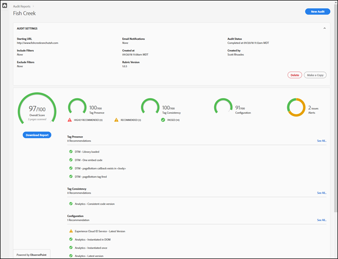
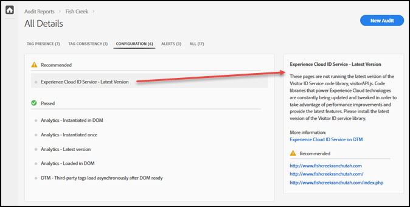

# Styrkort{#scorecard}

När du har kört ett test visar styrkortet information om en granskning.

Klicka på namnet på granskningen på Adobe Experience Platform Auditor-sidan för att visa resultatet av ditt test.

Använd styrkortet för att se hur granskningspoängen ser ut i följande kategorier:

* Total poäng
* Tagg presence

   Utvärderar om taggen finns och om den finns på rätt plats i sidkoden.
* Konsekvens för taggar

   Utvärderar om taggarna är konsekventa över URL-adresser.
* Konfiguration

   Utvärderar taggarna mot andra regler och rekommenderade metoder.
* Varning

   Varningar visar problem som du bör vara medveten om, men som inte påverkar ditt poängtal.

Din poäng beror på vikten av varje test och om du godkänns eller inte. Om du får det ökar poängen med det antal punkter som motsvarar testvikten.

* 0: Aviserar dig om problem som du bör vara medveten om, men som inte påverkar ditt resultat.
* 1: Rekommenderar en optimering. Ingen påverkan på datakvaliteten.
* 2: Om du inte gör det får du inte tillgång till de senaste funktionerna och korrigeringarna i Adobe Experience Cloud.
* 3: Testar effektiviteten och huruvida implementeringen följer rekommenderade metoder.
* 4: Fel innebär att du kanske samlar in otillförlitliga data.
* 5: Fel innebär att du kan se dataförlust.

Styrkortet visar alla problem på nivå 4 eller 5 som du **rekommenderar** att du åtgärdar.

Styrkortet visar alla problem på nivå 1 till 3 som **rekommenderas** att du åtgärdar.

Klicka på **[!UICONTROL Download the Report]** för att ladda ned en - eller PDF-fil som innehåller den information som granskaren rapporterat.[!DNL Excel]

Förutom poängen för varje kategori visas alla korrigeringar som rekommenderas eller rekommenderas, liksom vilka objekt som godkänts i testet. Klicka på varje nummer för att se mer information i rutan till höger. Klicka en gång till för att gå vidare och se rekommendationer för hur problemet kan åtgärdas. Nedan visas information om ett rekommenderat problem i styrkortet som visas ovan:

Klicka på kategorierna längst upp på skärmen för att se problemen i varje kategori.

## Vilka sidor ingick i testet? {#section-fd38ffeb868648e89c34c5772fa65f46}

Du kan visa listor över de URL:er som har godkänts eller misslyckats i testet.

Klicka på ett testnamn eller på **[!UICONTROL See All]** länken under varje kategorirubrik i styrkortet. Detta tar dig till detaljerna av testerna. För varje test kan du se testbeskrivningen och en lista över alla URL:er som har misslyckats och godkänts. Den här informationen ingår även i hämtade rapporter.
